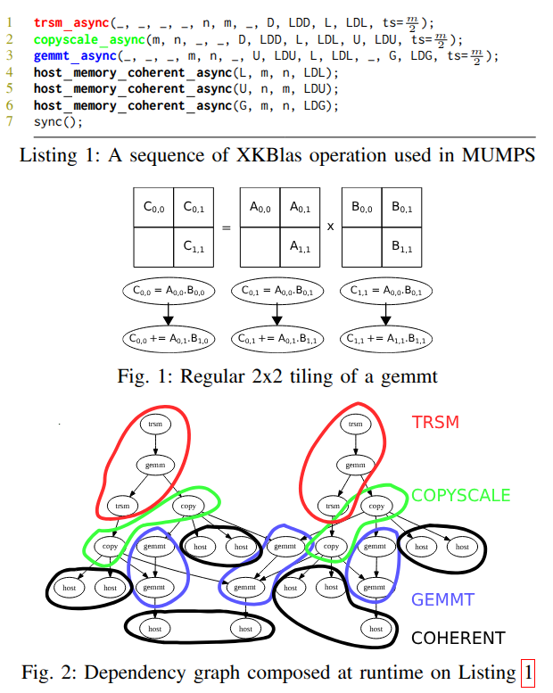

# XKBlas

XKBlas is a portable multi-gpu BLAS library, with built-in coherence between host and devices memories.

## Example
An XKBlas program is a sequence of BLAS calls with host-memory matrices, that are automatically tiled and distributed to multiple GPUs in an asynchronous fashion.



## Installation

### Requirements
- A C/C++ compiler with support for C++20 (the only compiler tested is LLVM >=20.x)
- xkrt - https://gitlab.inria.fr/xkaapi/dev-v2

### Optional
- Cuda, HIP, Level Zero, SYCL, OpenCL
- CUBLAS, HIPBLAS, ONEAPI::MKL

### Build command example
See the `CMakeLists.txt` file for all available options.
```bash
mkdir build
cd build
CC=clang CXX=clang++ CMAKE_PREFIX_PATH=$ONEAPI_ROOT:$CUDA_PATH:$CMAKE_PREFIX_PATH cmake -DUSE_CUDA=on -DUSE_CUBLAS=on -DUSE_SYCL=on -DUSE_MKL=on -DUSE_CLBLAST=on -DUSE_ZE=on -DCMAKE_BUILD_TYPE=Debug ../
```

## List of kernels supported
Kernels are being added lazily: if you need a missing kernel for a specific hardware, add it yourself or open an issue and someone will add it on a best effort basis.

Note that adding support for a new API (CUDA/HIP/Level Zero) on a kernel that is already supported by another API is rather straightforward (most likely ~10min of coding).

Adding support for an unsupported kernel may involve more work.

### Level 1
| Kernel      | CPU | CUDA | HIP | Level Zero/SYCL |
|-------------|-----|------|-----|-----------------|
| axpby       | ✗   | ✓    | ✗   | ✗               |
| axpy        | ✗   | ✓    | ✗   | ✗               |
| divcopy     | ✗   | ✗    | ✗   | ✗               |
| dot         | ✓   | ✓    | ✗   | ✗               |
| fill        | ✗   | ✗    | ✗   | ✗               |
| nrm2        | ✗   | ✗    | ✗   | ✗               |
| scalcopy    | ✗   | ✗    | ✗   | ✗               |
| scal        | ✓   | ✓    | ✗   | ✗               |

### Level 2
| Kernel      | CPU | CUDA | HIP | Level Zero/SYCL |
|-------------|-----|------|-----|-----------------|
| copyscale   | ✓   | ✓    | ✓   | ✗               |
| gemv        | ✓   | ✓    | ✗   | ✗               |

### Level 3
| Kernel      | CPU | CUDA | HIP | Level Zero/SYCL |
|-------------|-----|------|-----|-----------------|
| gemm        | ✓   | ✓    | ✓   | ✓               |
| gemmt       | ✗   | ✓    | ✓   | ✗               |
| herk        | ✗   | ✓    | ✗   | ✗               |
| symm        | ✗   | ✗    | ✗   | ✗               |
| syr2k       | ✗   | ✗    | ✗   | ✗               |
| syrk        | ✗   | ✓    | ✗   | ✗               |
| trmm        | ✗   | ✗    | ✗   | ✗               |
| trsm        | ✓   | ✓    | ✓   | ✗               |

### Lapacke
| Kernel      | CPU | CUDA | HIP | Level Zero/SYCL |
|-------------|-----|------|-----|-----------------|
| geqrf       | ✗   | ✗    | ✗   | ✗               |
| orgqr       | ✗   | ✗    | ✗   | ✗               |
| ormqr       | ✗   | ✗    | ✗   | ✗               |
| potrf       | ✗   | ✗    | ✗   | ✗               |

### Sparse
| Kernel      | CPU | CUDA | HIP | Level Zero/SYCL |
|-------------|-----|------|-----|-----------------|
| spmv (csr)  | ✗   | ✓    | ✗   | ✗               |

## Add a new routine

### Mandatory steps
Implementing a new routine includes at least the following steps:
- update the `CMakeLists.txt` variable `XKBLAS_ROUTINES`
- declare the routine prototype in `include/xkblas/for-all-routines.h`
- update the two macros in `include/xkblas/routine.hpp`
    - `XKBLAS_FORALL_ROUTINES`
    - `XKBLAS_FORALL_PRECISIONS_AND_ROUTINES`
- copy and modify an existing routine files, for instance
    - `cp src/routines/gemm.cc src/routines/custom.cc`
    - `cp api/c/src/routines/gemm.cc api/c/src/routines/custom.cc`

### Optional steps
If your routine requires a custom kernel, you can implement it as follows:
- update the `CMakeLists.txt` variable `XKBLAS_CUDA_KERNELS` and/or `XKBLAS_HIP_KERNELS`
- copy and modify an existing kernel file, for instance
    - `cp src/kernels/copyscale.cu src/kernels/custom.cu`

## Bindings to other programming languages
XKBlas is developed in C++ and provides three bindings:
- C with a single context implicitly managed (`xkblas_t`) - that follows original (2016) interfaces
- Julia that are generated automatically from C bindings
- native C++ with explicit context management

## Useful tips

XKBlas is built on top of XKRT. It means every interfaces of XKRT interoperates with XKBlas.

### Environment variables
`XKAAPI_NGPUS` specifies the number of GPUs to use.
You may want to couple it with vendor-specific variables to select specific GPUs (`CUDA_VISIBLE_DEVICES`, `HIP_VISIBLE_DEVICES`, `ZE_AFFINITY_MASK`).

### OpenBLAS wrapper
When building XKBlas, a library named `libxkblas_cblas.so` is also built and installed.
It implemented OpenBLAS's cblas ABI.
By setting `LD_PRELOAD=/path/to/libxkblas_cblas.so`, any programs linked to OpenBLAS can run on XKBlas (therefore, an original CPU program will end-up running on multiple-GPUs)

### Interoperability
For instance, that code compute a GEMM and outputs the first element of the matrix `C` - moving only a single byte from wherever it was computed, to the host.
```C++
xkblas_gemm_async(_, _, _, _, _, _, A, LDA, B, LDB, _, C, LDC);

runtime_t * rt = xkblas_xkrt_runtime_get();
rt.task_spawn<1>(
    [=C] (task_t * task, access_t * accesses) {
        new (accesses) access_t(task, &C[0], &C[1], ACCESS_MODE_R);
    },

    [=C] (task_t * task) {
        printf("C[0] = %lf", C[0]);
    }
);

xkblas_sync(); // or equivalently, rt.task_wait()
```

# TODOS
- Consolidate Intel implementation
- Implement missing cblas wrappers
- Implement missing kernels on above table

# Problems on Intel GPUs
- memcpy2D is broken
- Deadlock / pagefaults of what seems valid transfers
- It is unclear if that code is correct and what it does - currently using it in the gemm implementation
```
440 void func(ze_event_handle_t * eventPtr)
441 {
442     sycl::event event = oneapi::mkl::blas::column_major::gemm(
443         queue,
444         transa, transb,
445         m, n, k,
446         alpha,
447         a, lda,
448         b, ldb,
449         beta,
450         c, ldc,
451         mode,
452         dependencies
453     );
454     *eventPtr = sycl::get_native<sycl::backend::ext_oneapi_level_zero>(event);
455 }
```
